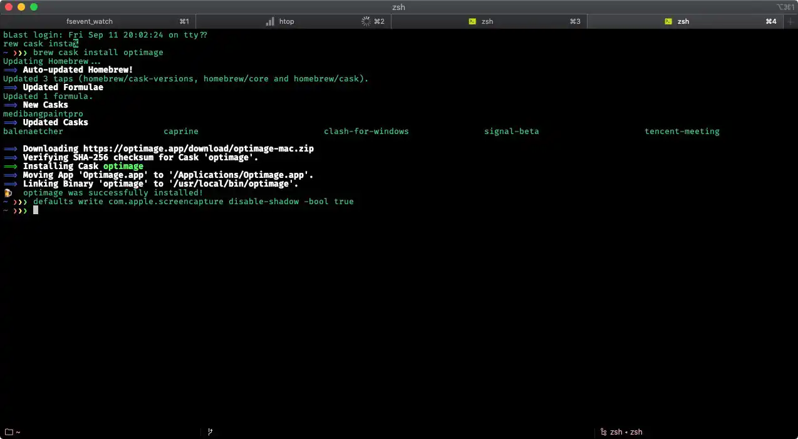

This is the second part of my "How I work" series. In case you missed it, [read the first part here](/blog/working-productively). In this part I will document with which tools I work on the command line.

I keep the configuration of most tools inside a so-called [dotfiles](https://github.com/gildesmarais/dotfiles) repository. This allows me to sync my configuration between machines. To manage the dotfiles on my machines, I use [rcm](https://github.com/thoughtbot/rcm) and version control them with [git](https://git-scm.com/).

While most tools do one thing good, chaining them by piping (`|`) or redirecting their output (`>`, `<`) makes working with the command line powerful and efficient. You need just a part of the output? No problem: pipe it to `awk` and choose only what you need.

Although I like the green colored characters on dark background scrolling by, they need to get out of the way quickly. I'm one of these computer users who clear the scrollback buffer with <kbd>Cmd</kbd>+<kbd>K</kbd> often.



## ZSH and its configuration

[zsh](https://www.zsh.org/) is my shell of choice. While I started with the oh-my-zsh configuration framework years ago, I've switched to [prezto](https://github.com/sorin-ionescu/prezto/) recently. The main reason was the time it took to start a new session. With prezto the startup time improved noticeably. It comes with a auto suggestion feature out of the box, so it'll save you some typing later.

My [`.zshrc`](https://github.com/gildesmarais/dotfiles/blob/master/zshrc) contains many aliases to save me some typing on reoccurring tasks. Some configuration options stand out and I'll describe what they do in the next sections.

### Move the cursor _by words_ with <kbd>Alt</kbd> + arrow keys

To use <kbd>Alt</kbd>+<kbd>←</kbd> and <kbd>Alt</kbd>+<kbd>→</kbd> to jump words with cursor, add this to your `.zshrc`:

```sh
bindkey "^[^[[C" forward-word
bindkey "^[^[[D" backward-word
```

### `history` + `!` = 💕

`history` gives a list of recent commands. Each line command has a prefixed number. Type that number with a prefixed exclamation mark, e.g. `!1729` and hit space to expand to that command.

I search the history with `history | grep foobar` often. To make things a bit easier, I've setup an alias for it:

```sh
alias hgrep="history | grep"
```

You can also _search_ using <kbd>Ctrl</kbd>+<kbd>R</kbd> or use `history | sk` (see below for `sk`).

### Navigation between directories

Beside `cd`, `cd ..` (in zsh you can omit cd and type just `..` or even `….`), I use `pushd` and `popd` to move back and forth between directories.

Whenever I create a new directory with `mkdir -p ~/whatever/foo/bar/baz` I like to change to it directly with `cd $_`.

### `z`: jump between recently visited directories

[ZSH-z](https://github.com/agkozak/zsh-z) is a tool to jump between directories you've visited recently. It's fuzzy-matching those and changes to the most often used path.

`z foobar` changes the working directory to e.g. `/Users/gil/projects/foobar/`.

## Version and package managers

Since I write code I need to install the environment to run that code in. Since every project has its own needs it's not suitable to go with one globally installed version. I've used [rvm](https://rvm.io/) and [nvm](https://github.com/nvm-sh/nvm) before switching to asdf vm.

- [asdf vm](https://asdf-vm.com/): a version manager to manage multiple installed versions of programming languages.

Since I work with Ruby and NodeJS a lot, I need their package managers, too:

- [bundler](https://bundler.io/)
- [yarn](https://yarnpkg.com/)

I don't bother to install software manually on my machine. homebrew exists and I can find almost anything to `brew install` I want.

- [homebrew](https://brew.sh/): macOS package management, also handles installation of GUI applications (so-called casks).

## Standard tools

What follows is a list of tools I use with a short description. Most of them are installable with homebrew out of the box. Try `brew search foobar`.

### Finding files, content or directories

- `find` (the [GNU coreutils](https://www.gnu.org/software/coreutils/) one, please): finds files and directories by their name, type, etc.
- [mc](https://midnight-commander.org/): good old Midnight Commander, a two pane file manager.
- [rg](https://github.com/BurntSushi/ripgrep): super fast searching for files containing your query.
- [skim](https://github.com/lotabout/skim): a (general purpose) fuzzy finder.

### Create, read, manipulate, save and delete files

- `echo`, `touch`, `grep`, `cat`, `tail`, `less`, `more`, `man`, `rm`: goes without saying.
- [jq](https://stedolan.github.io/jq/): a cli JSON processor. Mostly I'm piping output into it to pretty print.
- [ncdu](https://dev.yorhel.nl/ncdu): NCurses Disk Usage. Finds large files and directories and where you can deletes them from inside the convenient UI.
- [pup](https://github.com/EricChiang/pup): what `jq` is for JSON, `pup` is for HTML.
- [rpl](https://github.com/kcoyner/rpl/): replaces text inside files with another text (useful when I forgot the inline edit options of `grep` once again)
- [vim](https://www.vim.org/): is my default editor on remote machines. I don't know how to quit other editors like `emacs`. `¯\_(ツ)_/¯`

### Miscellaneous

The following tools are also in my toolbox. I file them under Miscellaneous as the amount would not justify categories on their own in this post. That does not mean that I use them less… most of them are invaluable.

These are helpful when dealing with (not only) remote systems:

- [ansible](https://www.ansible.com/): automatizes the setup of new systems.
- [htop](https://htop.dev/): an interactive process viewer. One of the first thing I install.
- [ssh](https://www.openssh.com/): SSH is a protocol which allows you to connect to remote servers securely.
- [rsync](https://rsync.samba.org/): synchronize files quickly (supports binary deltas).
- [tmux](https://github.com/tmux/tmux): terminal window multiplexer.

Sometimes you want to download something or need to make raw HTTP requests:

- [aria2](https://aria2.github.io/): universal download utility (http, ftp, bittorrent, magnet, …).
- [curl](https://curl.haxx.se/): for HTTP requests and debugging those. I can't work without it.
- [youtube-dl](https://youtube-dl.org/): download video and audio (not only from youtube).

Directly using [ffmpeg](https://ffmpeg.org/) with `youtube-dl` illustrates the power of the command line. Basic example:

```sh
youtube-dl -f bestaudio --exec 'ffmpeg -i {} {}.mp3 && rm {}'
```

## Outlook

That's it for the second part. The third part will inspect which GUI applications I use on macOS. Stay tuned.
