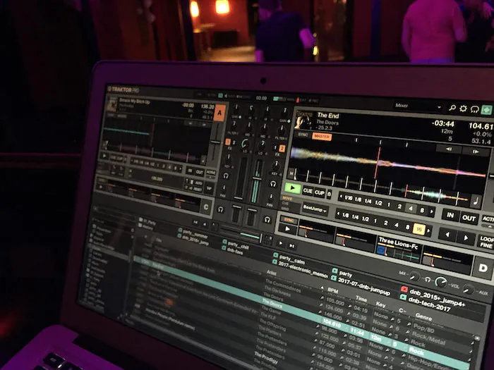

## Getting music

There are several ways to obtain music nowadays:

1. Rip it from CDs
   Use [ExactAudioCopy](https://exactaudiocopy.de/) on a windows machine with an optical disc reading device (they still exist outside museums).
2. Rip it from vinyl
   Use a turntable, a good analog to digital audio converter and use [Audacity](https://www.audacityteam.org/) to record it. Audacity offers some filters to reduce noise and remove cracks and pops.
3. Download from _web 2.0_[^1] websites
   [youtube-dl](https://github.com/ytdl-org/youtube-dl/) is the swiss-army-knife for downloading from those sites. Check if your local radio stations have a player or <q>Mediathek</q>.
4. Some radio stations provide their shows as podcasts.
5. Some DJs run their own podcast to promote themselves.
6. Buy it online.

## Before the import

### Transcode to a supported format

These tools come in handy:

- [ffmpeg](https://ffmpeg.org/) the swiss-army-knife for audio & video en-/trans-/decoding on the command line.
- [XLD](https://tmkk.undo.jp/xld/index_e.html) to transcode audio files, split one file to tracks, etc.

If you want lossless encodes in a iTunes library, there's no other choice than to transcode the files to _Apple Lossless_. XLD handles this case nicely.

### Set and clean ID3 tags

- [MusicBrainz Picard](https://picard.musicbrainz.org/) is matching the files' acoustic fingerprints against _freedb_[^2] and sets their tags accordingly.
- Use [mp3tag](https://www.mp3tag.de/) to derive ID3 tags from folder & file name and fixing ID3/APEv2 tags.
  Mp3tag is a power tool for mass manipulating and cleaning tags. It's outstanding and works well within wine. Nothing comes close to it and it is the only reason I keep wine installed.

  Wine is holding me back from upgrading to macOS Catalina as it does not support 64bit-only OSes yet. I'm, by the way, afraid of the Music.app which comes with macOS Catalina.

## Import files to library and organizing

All my music files are managed by iTunes. iTunes is really good in dealing with large music collections. I subscribed to iTunes Match to have the music available on all of my devices.

### iTunes Match restrictions

iTunes Match is sometimes slow.

It matches _clean_ versions of lyrically explicit tracks. It's annoying, but since voices annoy me in music and I rarely listen to rap, it does not affect me much. Also I keep the original files instead of replacing them with the matched version.

If you listen to DJ mixes, you will hit iTunes Match's `2 hour` or `200MB` file size limit.
Most of these mixes are distributed as MP3. [`mp3splt`](https://mp3splt.sourceforge.net/) splits the files evenly without re-encoding.

### Rating with a schema

After the import of new tracks, I start rating the tracks. Over time I've developed a rating schema (on a scale of 0 to 5 stars).

- `0 stars`: new to library, needs to be rated
- `1 stars`: rated to not keep.
- `2 stars`: keep for a reason, but the track is probably not good
- `3 stars`: an average track
- `4 stars`: a good track
- `5 stars`: a personal favorite track

[Stars](https://www.karelia.com/products/stars/) is useful to rate music via hotkey.

### Accurate genre field

I try to set specific genres: Instead of `Rock` I narrow it down to `Rock/Metal` or even `Rock/Metal/Black`. Here are a few other specific examples:

- `Drum & Bass/Jump-Up`
- `House/Bass`
- `Techno/Acid`
- `Techno/Hard`

Tagging something as `Pop` is basically avoiding to set a genre. For `Pop` I started adding the decade like this: `Pop/60`, `Pop/70`, …, `Pop/00`, `Pop/10`, `Pop/20`.[^3]

### Clean up the iTunes library with beaTunes

[beaTunes](https://www.beatunes.com/en/) not only analyzes the content of each track, but also inspects the iTunes library.
The inspection detects illogical tags, missing compilation tags, different notations of the same artist, finds duplicates, etc.

Go through the results and commit the results.

## Determining the _Key_ and _Energy_ with Mixed in Key

[Mixed in Key](https://mixedinkey.com/) analyses the _key_ and _energy_ of music files.[^4]

Create a smart playlist _MiK todo_ which lists all files without Energy or BPM and a rating of greater or equal than 2 stars.

## Creating playlists

Creating smart playlists makes so much more sense with the rated and analyzed tracks.
I recommend naming them wisely. I tend to follow the BEM naming convention[^5] and name them roughly like this:

- `stars__4`
- `stars__4+--bpm-124-127`

### Smart playlists

Scaffold a handful of smart playlists:

1. for Energy levels (filter rules depend on your Mixed in Key configuration)
2. for each possible rating (_Stars 0_, _Stars 1_, …, _Stars 5_)
3. for _Added in the last x weeks/months_.
   I have those for 4 weeks and 6 months and call them _added-4w_ and _added-6m_.

My rating scheme (see above) leads to two special _Star_ playlists:

- _Stars 0_ is my <q>to rate</q> playlist.
- _Stars 1_ is my <q>to remove</q> playlist.

Now you can create smart playlist like these:

- _Banger tracks_: Track is in playlist _Energy 8_ and _Stars 5_.
- _Calm popular music_: Genre begins with `Pop` and is in playlist _Energy 4_ or _Energy 5_.
- _Hard Techno post 2010_: Genre begins with `Techno/Hard` and `year >= 2010`, in playlist _Energy 6, 7, 8, 9_.
- More than 4 stars
- More than 4 stars and in BPM range 124 to 127
- Long and calm tracks: longer than x minutes, Energy less than 5.

### Using beaTunes

In beaTunes you can setup some criteria like <q>Instrumentation</q>, <q>Key</q>, <q>Speed</q> etc. and let it create a playlist for you based on a seed track selection. That is super nice and the results are good.
Time showed, I do not use that feature much. I'm fine with the smart playlists.

## Backup

1. I use [rsync](https://rsync.samba.org/) to sync the Music folder to my NAS:

```
rsync --archive --verbose --human-readable \
 --itemize-changes --progress \
 --prune-empty-dirs --delete \
 -e ssh ~/Music/iTunes me@NAS:~/backup/Music
```

2. export the playlists with [Doug's Batch Export Playlists](https://dougscripts.com/itunes/scripts/ss.php?sp=batchexportplaylists) script.
   ⚠️ Make sure to export your _Stars_ playlists! iTunes does not save the rating in the files' tags! With those playlists you can recover your ratings.
3. Add the exported playlists to a git repository and commit the changes, push to a remote host.

## Playing music

### iTunes

With iTunes match I can listen to my music on any of my  devices.

On desktop, I work with my the smart playlists and the <q>Column Browser</q> in the <q>Song</q> view mode:


### with MPD and Cantata

To play music on my stereo I launch [Cantata](https://github.com/cdrummond/cantata) to control the MPD which is connected to it via HDMI. It plays the files from my NAS. I `scp` the exported playlists (with corrected file urls) to the `playlists` folder of the mpd.

[^1]: A term coined in 2003 for the social web and user-generated content sites, etc.

[^2]: [freedb](https://www.freedb.org/) is a GNU GPL licensed track database.

[^3]: This is collision-free until the year 2049. The first Pop songs I own are from the 1950s (`Pop/50`).

[^4]: And more, like BPM. It can also set cue points to use with DJ standard software.

[^5]: [A naming convention for CSS.](https://en.bem.info/methodology/naming-convention/)

### DJ set preparation

When creating a DJ set, I have a playlist of _A tracks_ to play which acts like a track pool. Traktor reads my iTunes library and I usually just pick tracks out of that pool and go with it.

Some mixes may need more preparation. Then I create a plain old playlist in iTunes first and use that in [Traktor Pro 3](https://www.native-instruments.com/en/products/traktor/dj-software/traktor-pro-3/).


