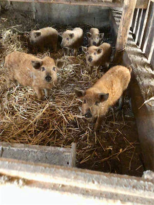

## A warning beforehand

This post does not contain graphic photos, but it might still be disturbing to read.
It is not intended as an instruction manual. You need experience to do this properly and legally.
If you're interested in deepening your knowledge, ask a slaughterer, a butcher, or your local administration for pointers.

## Introduction

I went to a farm to witness a home slaughtering in the winter of 2020. We were a group of five people including the slaughterer.

## The killing procedure

The killing procedure differs across regions for many reasons (rituals, laws, religion, tradition, personal preferences, etc.).

When choosing a pig to kill, you want to avoid as much stress as possible. Our isolated pig weighed around 80 to 90 kg, which seems normal for an adult pig. Expect some heavy lifting during the procedure:

- isolate a pig from the herd
- stun it (e.g. with [a bolt gun](https://en.wikipedia.org/wiki/Captive_bolt_pistol))
- cut the throat[^1]
- let it bleed out completely[^2]

Blood will squirt out of the cut. The pig will still twitch while and after it bleeds out. That's normal: the brain's last commands reach the muscles via the nerves.

Local laws might not always permit the most pain- and stress-free method. Measuring that impact is difficult, and the debate is fuelled by ethical, emotional, and moral questions.
For example, some do not stun the animal and simply cut the throat with a special knife and a clean cut.[^3] They often sit next to the animal beforehand, offer prayers, and talk to it calmly.[^4]

Many traditions include a toast to the now dead pig. We did the same.

## From a dead pig to two halves

Once the blood stopped flowing, the procedure continued.

- place the dead pig in boiling water
- remove fur thoroughly by scraping it off (e.g. with a [<q>Kratzglocke</q>](https://duckduckgo.com/?q=kratzglocke&iax=images&ia=images#))
- burn the remaining bristles
- hang the pig with its hind legs up
- cut it open: from the anus, via belly to the head while removing innards[^5]
- a veterinarian must check the meat for diseases[^6] and rate the quality[^7]
- saw it open: from the anus, via the back, through the head. Make sure to stay on the line and avoid cutting the meat.

Now you have two halves that are almost mirrored. Hang those halves for a day (or longer) in a cold room to dry out and allow the meat to relax. Traditional house slaughtering happens in late autumn or winter for that reason.

## Butchering: cutting halves to pieces

Depending on your butchering tradition, you start cutting pieces out of the halves. Without those cuts it would be hard to use the pig's meat.

The different parts of the pig also have different cooking characteristics: some are tender after a quick sear or grill, while others require a long cooking process to become tender. Some parts don't need to be cooked, like ham, but are preserved.

There are many different cutting methods, depending mostly on the cuisine and the pig's breed.
Read more about them in Wikipedia[^8] or your favorite non-veggie cookbook.[^9]

As our pig's breed is known for good (and plentiful) fats, we concentrated on the belly, bacon, etc.
When cutting, you usually avoid slicing through the red meat and instead follow the fascia and cut through fat.
Unnecessary fat is scraped off the meaty pieces. We put the fat aside and rendered it into lard.

The end result is pieces of meat you can buy at your butchery: ribs, cutlet, chops, tenderloin, neck, roasts, bacon, flank, etc.

## Observations and thoughts

Processing one pig causes a lot of work. A house slaughtering requires multiple people to help. During the day I was busy; most reflections surfaced afterwards.

### Avoiding stress

You want to avoid as much stress as possible during the killing procedure. Entering the sty should feel entirely normal for the pigs.[^10]

So far, so good. Change the perspective from pig to human for a second and imagine the situation yourself: if you knew your life would be taken by that person entering the sty, you'd be pumped with adrenaline and fight back.[^11]
Wouldn't it be kinder if it just got dark in front of your eyes and from that point on you noticed nothing anymore?

Switching the perspective back to the pig: adrenaline causes blood pressure to rise and fills all organs with water and oxygen. Blood in meat is to be avoided (it spoils), and water lowers the meat's quality (you can find it pooling between fascia and muscles). The stress hormones released will also decrease the meat's taste.
Some pigs have aching muscles _after_ the procedure. You can spot aching muscles from their color after hanging.

The isolation itself, which involves entering the sty and, for example, putting an iron cage around it, looks stressful to me.
Shooting a resting animal does not.[^12]

I'm afraid most pigs raised for meat won't have such <q>good</q> slaughtering conditions. A pig carried in a cramped lorry to the slaughterhouse for hours cannot be relaxed and calm.

The meat industry utilizes a handful of techniques to stun pigs.[^13]
For example, they use a gas chamber.
They put pigs in a gondola and move them underground. That room is filled with CO₂. Since CO₂ is heavier than oxygen, the pigs suffocate. While this requires less human interaction, the death itself is pure agony.

### Coping with routine

The slaughterer has killed plenty of animals in his life. Still, while the procedure was executed professionally, it was not an easy thing to do for him. It touched him.

This impressed me, and I wondered how people working at an industrial-scale slaughterhouse cope with it.

### The change from _animal_ to _product_

I still struggle to determine when my mind switched from calling the object _animal_ to _product_. I think that change happened shortly after the throat was cut and blood was flowing. As soon as that switch happened, I felt personally obligated to make the best use of the product. That means using everything the pig gave us.

### Using everything from the pig

Apart from some innards (lungs, heart, stomach), we used basically everything:

- we caught the blood to make blood sausage (heat it up and it will curdle).
- we cooked both halves of the head in water and scraped the meat to use in [Liverwurst](https://en.wikipedia.org/wiki/Liverwurst).
- we warmed the cut-off fat slowly and rendered lard (which we conserved in jars).
- we processed small pieces of meat, which are unusable as a whole, to make [Bratwurst](https://en.wikipedia.org/wiki/Bratwurst).
- we used the cleaned intestine for the Bratwurst.

With the innards you can prepare small dishes for instant consumption:

- scrambled eggs with brain and chives
- (scraped out the contents of the) spleen and fried them to eat on bread
- grilled liver with onions
- sliced kidney, seared

### Similarities to the human body

The pig's body and its organs are similar to a human body. I analyzed a pig's heart in biology class and opened one with a scalpel to comprehend how the two chambers work. That was decades ago, and the mental connection was lost. The organs of a pig mostly exist and work the same inside a human body.

### Lard makes a smooth skin

While I usually struggle in winter to maintain smooth skin on my hands, that day was different. My skin was very soft as I was touching lots of fat and meat.

Would I recommend lard as skin care?
Well, it has its pros, but the con is a distinct smell. My verdict: no.

Applying animal-produced substances on skin is not as uncommon as it sounds. [Lanolin](https://en.wikipedia.org/wiki/Lanolin) is widely used in skin-care products and is a secretion from sheep.

### Lost connection meat<>animal, and decline of knowledge across generations

Later that week I talked to my dad about the day. For him it was a normal thing to do in winter, but he hasn't done it for decades. Back then he helped the family or neighbors slaughter a pig. And it seems pretty normal for the generation who lived in 1960/1970.

That made me realize that the knowledge about slaughtering and its practical application slowly gets lost. It's not widely available anymore; it is concentrated on a few people.

For me that knowledge is mandatory. It keeps a connection from the meat at the butcher's outlet to the pig. The home slaughtering was a missing link.

### A well-fed pig tastes amazing

It's true. There is nothing more to add to the headline.

### People are skeptical of homemade Liverwurst

I brought a jar of conserved Liverwurst back home and brought it to the office the other day. I told some colleagues about my experience. Some were eager to try it, but the majority wasn't so keen.
They usually do not refrain from trying the food I bring and offer. Somehow people were doubtful about the Liverwurst. My partner made the exact same experience with her colleagues.

And I wonder why that is.
Do people trust the meat industry more? Were they offended when I told them which parts of the pig were in it? Do they think the industrially produced liverwurst is of better quality? Or mine unsafe to consume?

Maybe we should have ground the meat finer so it would have been a unicolored mass without tiny chunks in it. Or maybe we should have used pickling salt to keep a shiny red instead of a gray product. ;)

I don't mind too much about their reaction, don't get me wrong. I suspect people just don't want to be confronted with the whole process when eating meat products.

### Changing habits

Did I change my eating habits because of this experience?
Yes, and I remain a carnivore. I buy only organically raised meat when possible and avoid low-cost mass-produced meat.[^14]

I still eat sausages even though I know what's in them.

## Closing

I recommend anyone who has the chance to witness a home slaughtering of an animal to take part in it.

It won't be a joyful day, but it will be a day full of physical work that you will remember. It might change your opinion on some things (in whatever way).

---

[^1]: It's important to not cut the trachae, as that would allow blood to fill the lungs.

[^2]: We caught all the blood and mixed it in a bowl to make [blood sausage](https://en.wikipedia.org/wiki/Blood_sausage) out of it. In some religions consuming the blood is forbidden and is thus wasted.

[^3]: [Wikipedia: Shechita](https://en.wikipedia.org/wiki/Shechita)

[^4]: If you're eager to _see_ more, search your favorite user-generated video platform.

[^5]: The innards are full of valuable nutrients. However, I choose not to eat some innards from a commercial fattened pig due to the amount of medicine.

[^6]: Especially for [Trichinella (Wikipedia)](https://en.wikipedia.org/wiki/Trichinella)

[^7]: [German: Schlachttier- und Fleischuntersuchung](https://de.wikipedia.org/wiki/Schlachttier-_und_Fleischuntersuchung)

[^8]: e.g. compare [_English: Cut of pork_](https://en.wikipedia.org/wiki/Cut_of_pork) and [_German: Teilstücke des Schweinefleischs_](https://de.wikipedia.org/wiki/Teilst%FCcke_des_Schweinefleischs)

[^9]: If your cookbook does not list cuts of meat, get a cookbook and not just a collection of instructions to create meals.

[^10]: Also change their food beforehand to avoid a full pig's stomach.

[^11]: Pigs can jump man-high. I saw it.

[^12]: In German speaking countries this is called <q>Weideschlachtung</q>. For Germany it is regulated in [Anlage 1 Nr. 2 in TierSchlV](https://www.gesetze-im-internet.de/tierschlv_2013/anlage_1.html). The slaughterer has to apply for allowance which is linked with some other duties.

[^13]: For Germany, see [Anlage 1 Nr. 2 in TierSchlV](https://www.gesetze-im-internet.de/tierschlv_2013/anlage_1.html)

[^14]: The German laws aren't really pushing to a sustainable consumption of meat. There's no mandatory labeling for the _growing-up standards_ and the different types of seals are more green-washing than an improvement for the animals.
