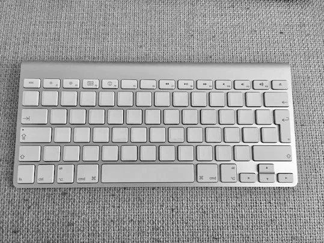

About two years ago, I taped the keys on my work keyboard with fitting white labels.

The idea was to force myself to get better at typing without looking.[^1]

I assumed I already typed without looking most of the time.
The labels quickly proved me wrong — each glance at the keyboard reminded me how often I still peeked. It happened unconsciously a few times a day.

For a while I struggled to press the correct key in the number row. There is no indicator like on the F and J keys. With time I became more precise, but you can't fully make up the missing indicators.

I ran out of labels to tape the function-key row and some modifier keys. I know the modifier keys in and out. Pressing one of the function keys is a deliberate operation in my opinion. When pressing one, I look at the keyboard, press that key, and wait for the function to trigger.

Even after two years, the taped keys nudge me toward better habits. I'm still practicing, but it's progress I can feel in my own workflow.

[^1]: OK, there is another reason why I did this: I bought the keyboard of someone and it has a <q>Nordic</q> key layout, which contains characters which I've never seen before.
