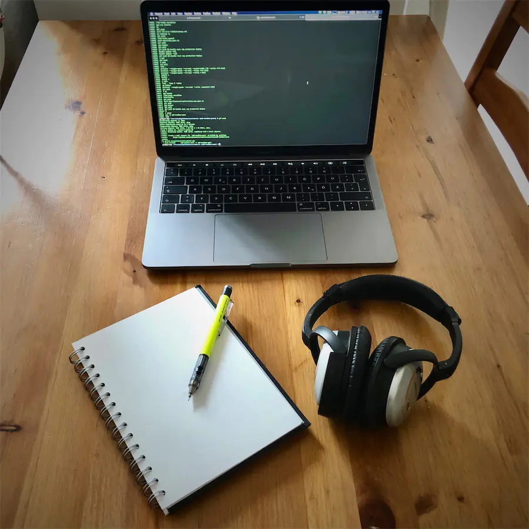

I've been asked how I work. In this case _work_ means the development of software.
That's an interesting question which isn't answerable in a single sentence, nor a single blog post. This is the first post which focuses on the involved devices, utilities and the optimal environment.

## Devices

I prefer a  Macbook (Pro or a full-spec Air) as my main working machine.

A well equipped desk contains at least:

- a screen with 2560×1440px (WQHD) resolution with 109dpi minimum
- the <q>old</q>  trackpad
- the <q>old</q>  [wireless keyboard](/blog/why-i-taped-the-keys-on-my-keyboard) with _International Layout_[^1]
- a laptop stand to move the machine above the level where I place fluid containers
- a transparent desk-pad to place cheat sheets below it

Usually I'm wearing a Bose QC15 headphone with Airmod for bluetooth connectivity. The headphones are with me for seven years. I use them every working day for at least 6 hours. Despite their age they are in good shape.
Some parts wear out and thus I've replaced the ear cushions multiple times and the headband once with after market parts for a few Euros. The headphones cause an aura of silence around me and are super comfortable.[^2] They run with one AAA battery.

For the wireless devices I have a box of fully charged AA and AAA rechargeable batteries in reach.

## Utilities

To keep my thoughts or prototype a UI, I rely on a DIN A5 sketchbook (with at least 150g/m2 paper) and a mechanical pencil with 0.5mm B lead.[^3]

Sometimes I (prefer to) work offside a desk. Then I need my headphones, the sketchbook and the computer as a minimal setup.
Staying hydrated and reducing waste is important. I have a reusable water bottle with me most of the time.

## Environment

### Getting into the flow with music

Shielding myself from outside noises plays a key part to get into the flow. The flow is a <q>mental state in which a person performing an activity is fully immersed in a feeling of energized focus, full involvement, and enjoyment in the process of the activity.</q>[^4]

To get into it I listen to electronic music mixes. Listening to anything that requires constant attention or someone talking every few minutes is destroying it. For the same reason I avoid listening to music podcasts or radios shows where every track is announced.[^5]

A favorite source of fresh music is the [BBC Radio 1 Essential Mix](https://www.bbc.co.uk/programmes/b006wkfp). The Essential Mix is long running (est. 1993) radio show where DJs (usually) play a 2h mix. It hosted remarkable talent during the years.

Creating an Essential Mix is the supreme discipline of electronic music in my opinion. The format gives the chance to DJs to create a journey and let them play tracks they'd skip on a rave.

Depending on my mood of the day, I choose one of ~20 all-time favorites. That means I listen to the same mixes regularly. The purpose is to have zero surprise moments while getting into **the flow**.[^6]

You will probably see me grooving by moving my fingers/arms/head/etc to music. This is an optical indicator that I'm _in the flow_. When I'm lucky I got goosebumps from the music, and than it can't be any better.[^7]

### Reducing interruptions

Interruptions destroy the flow state instantly.

Some interruptions can be controlled by myself and thus I acted upon them:

- I turned off all system sounds of macOS.
- I disabled the macOS notification center.
- Notifications on my phone make no sound or vibration.
- Notifications on my phone do not turn on its display.
- I never ever turn on the sounds on my phone

I made one conscious exception: my watch vibrates when I receive a message of a few important people in my life.

If you want any synchronous communication with me (a phone call, a meeting, …) then I advise you to send a calendar invitation with a fixed date and time. Or become efficient in typing and sending emails. :)
I do not send voice messages, they're pesky and I would not want to receive those, too.
If we're working in the same room, then please stop your devices from emitting sounds. It's the year 2020, come on already.

The star in our solar system also annoys sometimes. It is especially annoying as our planet moves around it and thus the relative position of it changes.
With knowing at which hemisphere I'm located, predicting the direction of movement is easy. This way I can prevent some foreseeable annoyances: direct hit rays and reflections. What I do against it is up to be decided case-by-case.

Some interruptions are entirely out of my control:
Someone walking to my desk and asking <q>may I interrupt you</q> is a meta-question and … 🥁 … an interruption.
Boom, flow state destroyed.
Next step: switching my brain's context, digest what is being said. That will take a good amount of seconds. It will take a good amount of an hour to get back into the flow. It takes a huge amount of my mental energy.
While I see it's sometimes unavoidable to ask or tell someone something, I urge you to _never do that_ **inconsiderately**. It can probably wait.

I don't understand why trams in Berlin are unable to turn (more) silently. I've seen (and heard) trams turning almost silently in other countries (built by the same manufacturer). These screeching noises (ignoring the house-shaking vibrations) is a serious concentration killer as noise-canceling headphone can't filter that out.

## Reducing strains

I think, when working with computers, the keyboard should give you the full control over everything. I'm not saying that having a computer mouse is a bad idea.
A mouse is required sometimes, but well, maybe not a mouse, just a device to move the cursor.[^8]

The settings and placement of the devices matter. I …

- turn down the brightness on the screen as much as sensible.
- use dark background colors (Dark Mode) everywhere.
- place the screen in the front.
- put the laptop aside the screen (I prefer the right-hand side).
- place the trackpad in front of the keyboard, like they are positioned on a laptop.

Touching the trackpad to move the cursor is a flaw I try to avoid at any time. Moving them closer together reduces the movement needed to reach them. The main problem remains tho: it's time-intensive and puts a strain on your wrist.

## Moving around

I prefer sitting next to a window and have daylight. If that's not possible a dimmable workbench lamp helps to mitigate.

I stand up every hour for a few minutes. My watch reminds me to be active.[^9]
Depending on the time, getting a coffee is usually a good idea in the morning.
In the afternoon I likely do some exercises/movements: swirl my arms, circle my head, raise/lower my shoulders, hold myself on the pull-up bar for a minute, do some pull-ups, maybe plank for 3 minutes.
At any time it's a good moment to look outside and focus something in the distance. If possible, I get some deep breaths of fresh air and/or air the room. My brain and eyes are relived afterwards.

## Outlook

That's basically it for these aspects. I hope you found it insightful. Did I miss anything? [Let me know!](/contact)

Stay tuned for the next parts on which I'll explain which software I use to work efficiently.

[Continue reading the second part here](/blog/how-i-work-part-2-the-command-line).

[^1]: That is QWERTY with a two rows spanning return key. Also known as _British Layout_.

[^2]: That still holds true with the after-market parts. Bose, naturally, has a different opinion on that, [read their QC35 investigation report](https://community.bose.com/t5/Around-On-Ear-Headphones/Bose-QC-35-Firmware-4-5-2-Noise-Cancellation-Investigation/m-p/285738#M56820) for a thorough explanation.

[^3]: I have a soft spot for good pens and pencils. I use a mechanical pencil 99% of the time. The faible is counter-intuitive to my minimalist side. The latter wins.

[^4]: [Wikipedia: Flow (psychology)](<https://en.wikipedia.org/wiki/Flow_(psychology)>), 2020-04-10.

[^5]: One exception: Fabio & Grooverider's long running radio show. They broadcast on [RinseFM](https://rinse.fm/schedule/) by now. I see Fabio & Grooverider as ambassadors of music. They really dig out the [choons](https://www.urbandictionary.com/define.php?term=choon) which will never be released … or _maybe_ in 3 months. They also have a superb time together: they're joking, laughing, make many technical mistakes (leaving the microphone open is a classic) and they transport an overwhelming amount of joy. I somehow manage to stay in the zone with these brilliant chaps.

[^6]: I also find Pete Tong's voice introducing every mix soothing (If you're reading this, Pete: Heya 👋).

[^7]: I hope you had goosebumps caused from music at least once in your life.

[^8]: I really want a perfectly working eye tracking device. Privacy respecting and easy to setup. ([<q>Plug it in, switch it on and … _BSOD_ **woo**</q>](https://invidio.us/watch?v=IW7Rqwwth84&local=true&quality=hd720)).

[^9]: Sounds silly to need a reminder, no? It isn't, I was afraid to learn how seldom I stand up when being in the flow.
